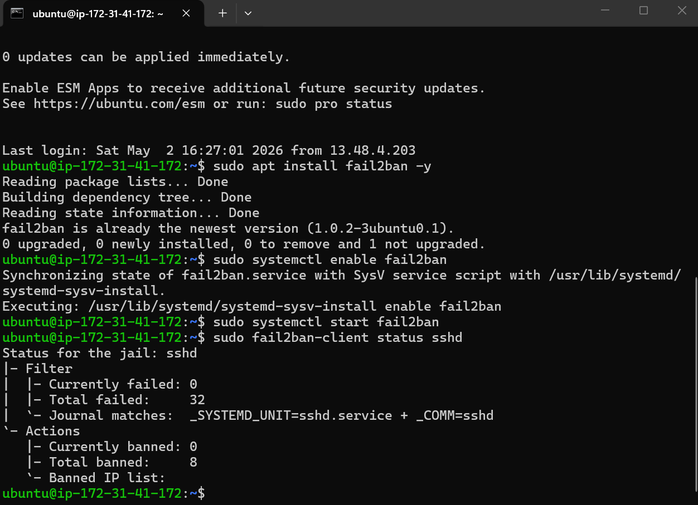

# 🔐 Linux Security Lab

---

## 🇬🇧 English

### Overview
This project demonstrates hands-on Linux security practices focused on SSH monitoring, log analysis, and basic intrusion detection.

### What I did
- Monitored SSH authentication logs
- Detected brute-force login attempts
- Analyzed failed login attempts from `/var/log/auth.log`
- Extracted attacker IP addresses from logs
- Implemented Fail2Ban to block unauthorized access
- Performed basic network scanning with Nmap

### Tools & Technologies
- Ubuntu Linux
- OpenSSH
- Nmap
- Fail2Ban

### Key Findings
- Multiple failed login attempts detected
- Invalid user access attempts identified
- Attacker IP addresses extracted
- Basic intrusion prevention configured

---

## 🇹🇷 Türkçe

### Proje Özeti
Bu proje, Linux sistemlerinde SSH izleme, log analizi ve temel saldırı tespiti üzerine uygulamalı çalışmalar içerir.

### Yapılanlar
- SSH giriş logları incelendi
- Brute-force (şifre deneme) saldırıları tespit edildi
- `/var/log/auth.log` üzerinden başarısız girişler analiz edildi
- Saldırgan IP adresleri loglardan çıkarıldı
- Fail2Ban ile yetkisiz erişimler engellendi
- Nmap ile temel port taraması yapıldı

### Kullanılan Araçlar
- Ubuntu Linux
- SSH
- Nmap
- Fail2Ban

### Bulgular
- Birden fazla başarısız giriş denemesi tespit edildi
- Geçersiz kullanıcı girişleri bulundu
- Şüpheli IP adresleri analiz edildi
- Temel saldırı önleme yapılandırıldı

---

## 📸 Screenshots

### SSH Failed Login Analysis


### Fail2Ban Protection


---

## 📂 Commands Used

```bash
sudo grep "Failed password" /var/log/auth.log
sudo grep "Failed password" /var/log/auth.log | tail -n 5
sudo grep "Failed password" /var/log/auth.log | awk '{print $11}' | sort | uniq -c

nmap -p 22,80,443 <target-ip>

sudo systemctl start fail2ban
sudo fail2ban-client status sshd
